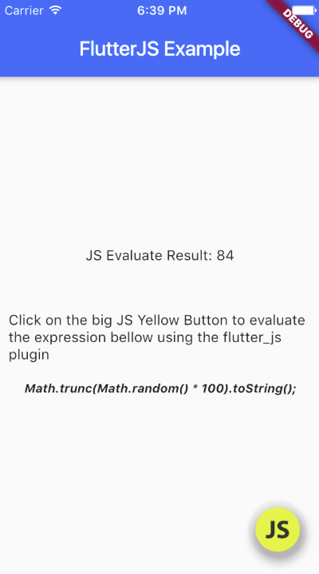
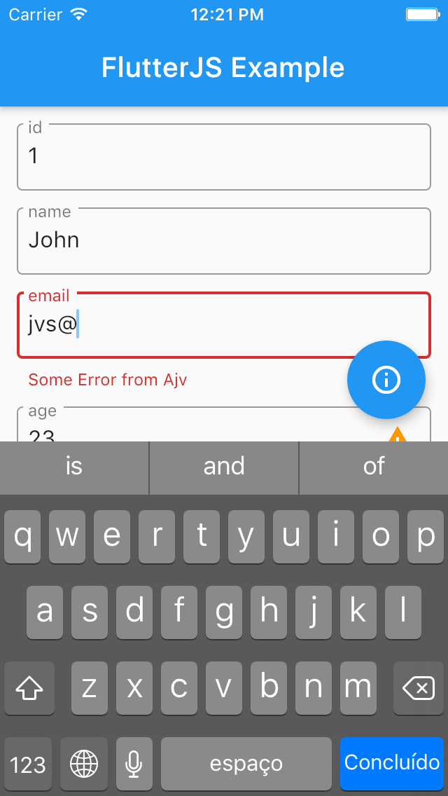
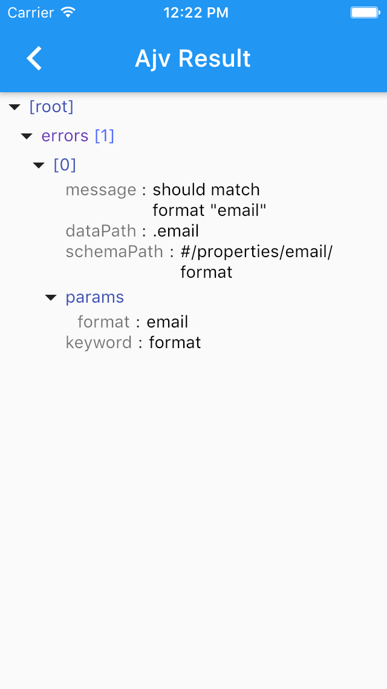
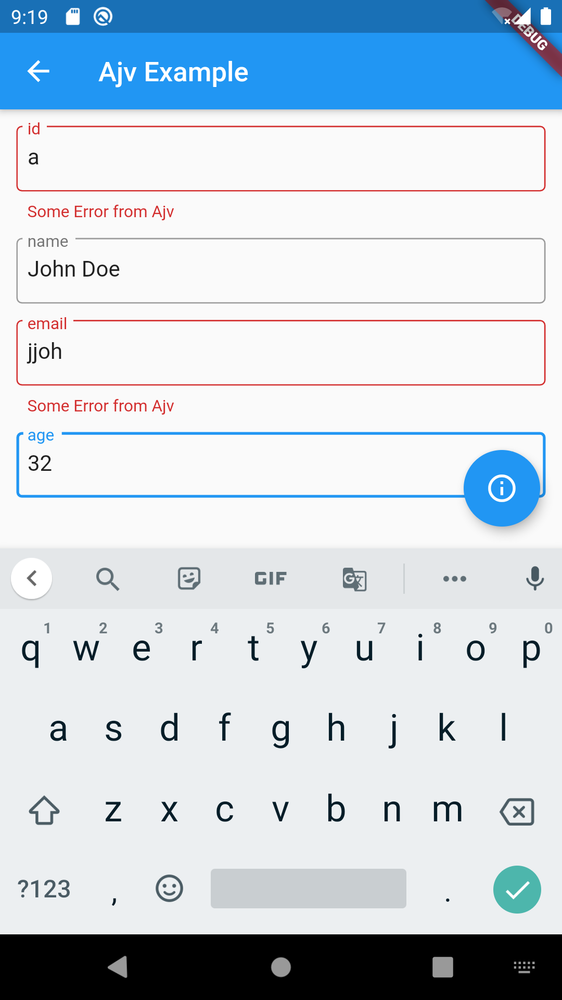
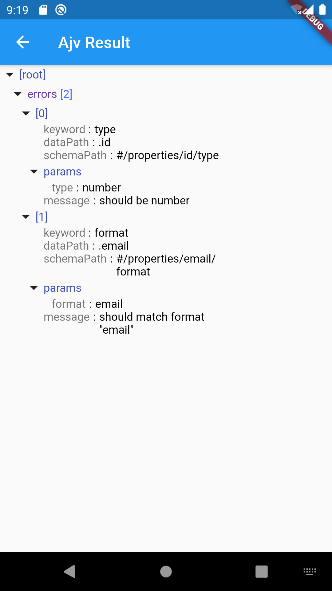

# Flutter JS plugin

A Javascript engine to use with flutter. It uses quickjs on Android and JavascriptCore on IOS. The Javascript runtimes runs synchronously through the dart ffi in both platforms. So now you can run javascript code as a native citzen inside yours Flutter Mobile Apps.

In the previous versions we only get the result of evaluated expressions as String. 

**BUT NOW** we can do more with  flutter_js, like run xhr and fetch http calls through Dart http library. We are supporting Promises as well.

With flutter_js Flutter applications can take advantage of great javascript libraries such as ajv (json schema validation), moment (DateTime parser and operations) running natively (no PlatformChannels needed, so the javascript evaluation runs synchronously) on mobile devices, both Android and iOS.

~~On IOS this library relies on the native JavascriptCore provided by iOS SDK. In Android it uses the amazing and small Javascript Engine QuickJS [https://bellard.org/quickjs/](https://bellard.org/quickjs/) (A spetacular work of the Fabrice Bellard and Charlie Gordon).~~
~~It was ported to be used in Android through jni in this project i recently found on Github: [https://github.com/seven332/quickjs-android](https://github.com/seven332/quickjs-android).~~
~~We used seven332/quickjs-android in the very first versions of flutter_js. Thanks to [seven332](https://github.com/seven332)~~

~~Recently we found the [oasis-jsbridge-android](https://github.com/p7s1digital/oasis-jsbridge-android) repository which brings quickjs integration to Android to a new level (Close to what JavascriptCore offers in iOS). So,
since version 0.0.2+1 we are using oasis-jsbridge-android quickjs library as our javascript engine under the hood. So thanks to the guys of [p7s1digital](https://github.com/p7s1digital/) team to theirs amazing work.~~  


On Android it uses the amazing and small Javascript Engine QuickJS [https://bellard.org/quickjs/](https://bellard.org/quickjs/).  On IOS, it uses the Javascript Core. In both platforms we rely on dart ffi to make calls to the js runtime engines, which make javascript code evaluation an first class citzen inside Flutter Mobile Apps. We could use it
to execute validations logic of TextFormField, also we can execute rule engines or redux logic shared from our web applications. The opportunities are huge.


The project is open source under MIT license. 

The bindings for use to communicate with JavascriptCore through dart:ffi we took it from the package [flutter_jscore](https://pub.dev/packages/flutter_jscore).

Flutter JS provided the implementation to the QuickJS dart ffi bindings ourselves and also constructed a wrapper API to Dart which
provides a unified API to evaluate javascript and communicate between Dart and Javascript. 

This library also allows to call xhr and fetch on Javascript through Dart Http calls. We also provide the implementation
which allows to evaluate promises returns.





## Features:

## Instalation

```yaml
dependencies:
  flutter_js: 0.1.0+0
```

### iOS

Since flutter_js uses the native JavascriptCore, no action is needed.

### Android

Change the minimum Android sdk version to 21 (or higher) in your `android/app/build.gradle` file.

```
minSdkVersion 21
```
 

## Example

Here is a small flutter app showing how to evaluate javascript code inside a flutter app


```dart
import 'package:flutter/material.dart';
import 'dart:async';

import 'package:flutter/services.dart';
import 'package:flutter_js/flutter_js.dart';

void main() => runApp(MyApp());

class MyApp extends StatefulWidget {
  @override
  _MyAppState createState() => _MyAppState();
}

class _MyAppState extends State<MyApp> {
  String _jsResult = '';
  JavascriptRuntime flutterJs;
  @override
  void initState() {
    super.initState();
    
    flutterJs = getJavascriptRuntime();
  }

  @override
  Widget build(BuildContext context) {
    return MaterialApp(
      home: Scaffold(
        appBar: AppBar(
          title: const Text('FlutterJS Example'),
        ),
        body: Center(
          child: Column(
            mainAxisAlignment: MainAxisAlignment.center,
            children: <Widget>[
              Text('JS Evaluate Result: $_jsResult\n'),
              SizedBox(height: 20,),
              Padding(padding: EdgeInsets.all(10), child: Text('Click on the big JS Yellow Button to evaluate the expression bellow using the flutter_js plugin'),),
              Padding(
                padding: const EdgeInsets.all(8.0),
                child: Text("Math.trunc(Math.random() * 100).toString();", style: TextStyle(fontSize: 12, fontStyle: FontStyle.italic, fontWeight: FontWeight.bold),),
              )
            ],
          ),
        ),
        floatingActionButton: FloatingActionButton(
          backgroundColor: Colors.transparent, 
          child: Image.asset('assets/js.ico'),
          onPressed: () async {
            try {
              JsEvalResult jsResult = flutterJs.evaluate(
                  "Math.trunc(Math.random() * 100).toString();");
              setState(() {
                _jsResult = jsResult.stringResult;
              });
            } on PlatformException catch (e) {
              print('ERRO: ${e.details}');
            }
          },
        ),
      ),
    );
  }
}

```


## Alternatives (and also why we think our library is better)

There were another packages which provides alternatives to evaluate javascript in flutter projects:

### https://pub.dev/packages/flutter_liquidcore

Good, is based on https://github.com/LiquidPlayer/LiquidCore

It is based on V8 engine so the exectuable library is huge (20Mb). So the final app will be huge too.


### https://pub.dev/packages/interactive_webview

Allows to evaluate javascript in a hidden webview. Does not add weight to size of the app, but a webview means a entire browser is in memory just to evaluate javascript code. So we think an embeddable engine is a way better solution.

### https://pub.dev/packages/jsengine

Based on jerryscript which is slower than quickjs. The jsengine package does not have implementation to iOS.

### https://pub.dev/packages/flutter_jscore

Uses Javascript Core in Android and IOS. We got the JavascriptCore bindings from this amazing package. But, by
default we provides QuickJS as the javascript runtime on Android because it provides a smaller footprint. Also 
our library adds support to ConsoleLog, SetTimeout, Xhr, Fetch and Promises.


## Small Apk size

A hello world flutter app, according flutter docs has 4.2 Mb or 4.6 Mb in size.

https://flutter.dev/docs/perf/app-size#android


Bellow you can see the apk sizes of the `example app` generated with *flutter_js*:

```bash

|master ✓| → flutter build apk --split-per-abi

✓ Built build/app/outputs/apk/release/app-armeabi-v7a-release.apk (5.4MB).
✓ Built build/app/outputs/apk/release/app-arm64-v8a-release.apk (5.9MB).
✓ Built build/app/outputs/apk/release/app-x86_64-release.apk (6.1MB).
```


## Ajv

We just added an example of use of the amazing js library [Ajv](https://ajv.js.org/) which allow to bring state of the art json schema validation features
to the Flutter world. We can see the Ajv examples here: https://github.com/abner/flutter_js/blob/master/example/lib/ajv_example.dart 


See bellow the screens we added to the example app:

### IOS





### Android






